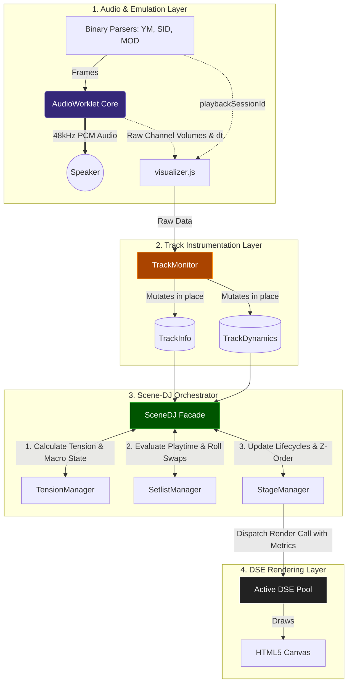

Here is the completely revised and expanded **Technical Specification** for `v1.2.0`. It now fully documents the ECS (Entity-Component-System) architecture, the zero-allocation data models, the separated DJ skills, and features the brand-new chapter detailing all DSEs and their precise reactions to macro/micro dynamics.

Save this document as `doc/Technical_spec.md`.

***

```markdown
# 💾 TECHNICAL SPECIFICATION: AUDIO-VISUAL PIPELINE & SCENE-DJ ARCHITECTURE
**Version:** 1.2.0 (Modular ECS-Pattern Revision)

This document outlines the architectural blueprint of the Chiptunes Fantasy real-time audio-visual pipeline. To maintain strict separation of concerns and guarantee 60FPS performance on low-end devices, the system decouples audio emulation, DSP analysis, scene orchestration, and rendering into distinct, zero-allocation modules.

---

## 1. The Audio-Visual Pipeline

The core rendering loop utilizes a **Unidirectional Data Flow**. State changes propagate strictly from the application layer down to the visual layer. The `SceneDJ` acts as a facade, coordinating data between specialized sub-modules ("Skills") without executing rendering code itself.



---

## 2. Track Instrumentation (`TrackMonitor`)

The `TrackMonitor` serves as the bridge between the raw audio output and the visual orchestrator. Its sole responsibility is to translate raw `channelVolumes` and app state into two highly structured, **zero-allocation data classes**.

### 2.1. `TrackInfo` (Static Context)
Contains metadata about the currently playing song. 
*   `system` (String): The active hardware tab (`'c64'`, `'amiga'`, `'atari'`).
*   `sessionId` (Number): A monotonically increasing ID. When this changes, the DJ executes a hard reset on tension accumulators (Unidirectional State Syncing).
*   `isPlaying` (Boolean): Global playback state driving the "Instant Wake-Up" or "Soft Sleep" transitions.

### 2.2. `TrackDynamics` (Real-Time Metrics)
Updated every frame (60Hz). Contains the heavily filtered DSP metrics utilized by the DSEs.
*   `masterEnergy` (Float): The RMS moving average of all active channels.
*   `transientPulse` (Float): True rising-edge delta measuring instantaneous drum hits (`max(0, raw - smooth)`).
*   `beatEnvelope` (Float): An exponential decay curve (`0.0 -> 1.0`). Triggers instantly on severe transients and decays smoothly. Used for Micro-Dynamics.
*   `rawEnergyState` (String): The instantaneous, debounced threshold evaluation (`'playing'`, `'buildup'`, `'climax'`).

---

## 3. The Scene-DJ (Coordinator & Skills)

The `SceneDJ` delegates all logic to specialized "Skills" (Sub-Modules).

### Skill 1: `TensionManager` (Macro-Dynamics)
Reads the crowd and builds suspense using a mathematical accumulator (`tension`).
*   **Logic:** Integrates `masterEnergy` and `transientPulse` over time. If the track hits an overdrive threshold, accumulation is multiplied by `4x` or `6x`. 
*   **The Climax Lock:** Once `tension >= 20.0`, the state locks into `climax`. The hold timer only drains when the track's real-time energy falls below overdrive thresholds, ensuring visually rewarding drops.
*   **Debouncing:** Implements a `0.5s` `MIN_BUILDUP_TIME` to prevent chaotic visual flickering between `playing` and `buildup` states.

### Skill 2: `SetlistManager` (Crate Digger / Swapping)
Responsible for variety and aesthetic coherence.
*   **Weighted Roulette Selection:** Uses `metadata.weight` to randomly select elements for a specific layer.
*   **Dynamic Weight Penalties:** If the roulette re-selects the currently active DSE, its `weight` is halved and its `stateTime` is reduced by 5s to force faster re-rolls, preventing visual stagnation.
*   **Black-Screen Protection:** Evaluates the active pool. If all non-overlay layers resolve to `isVoid === true`, it forces a re-roll of one layer to a physical GFX element to ensure the canvas is never completely empty.

### Skill 3: `StageManager` (Lifecycle & Crossfades)
The stage technician managing the active visual pool.
*   **State Machine:** Routes DSEs smoothly through `idle` $\to$ `starting` (1.5s) $\to$ `[macroState]` $\to$ `stopping` (1.5s) $\to$ `idle`.
*   **Instant Wake-Up:** Bypasses debouncing when transitioning from a stopped (`idle`) state to playback, triggering an immediate visual fade-in and a fresh DSE roulette roll.
*   **Z-Order Sorting:** Enforces strict rendering order (`background` $\to$ `floor` $\to$ `foreground` $\to$ `overlay`).

---

## 4. DSE Metadata Contract

Visual effects are decoupled classes registered inside `dse/registry.js`. The `defineDSE` wrapper validates the schema at compile time.

| Property | Type | Description |
| :--- | :--- | :--- |
| `name` | `String` | Human-readable class identifier. |
| `computerType` | `Array` | Hardware compatibility (`['c64']`, `['amiga']`, `['atari']`, `['all']`). |
| `placementType` | `String` | Z-Order assignment (`background`, `floor`, `foreground`, `overlay`). |
| `weight` | `Number` | Relative probability weight for the Roulette-Wheel selection. |
| `minPlayTime` | `Number` | Minimum seconds the DSE must run before it can be swapped. `Infinity` creates a permanent lock (used for the LimitBar). |
| `climaxHoldTime`| `Number` | The duration (in seconds) the DSE requests to stay in climax after track energy drops. The DJ uses `Math.max()` of all active DSEs. |
| `isVoid` | `Boolean` | Flags a zero-CPU transparent placeholder used for screen clearing. |

---

## 5. DSE Arsenal & Reactivity Mapping

Demo-Scene-Elements are designed to react to **Macro-Dynamics** (the overall `state` string managing base speed and pattern complexity) and **Micro-Dynamics** (the `metrics.beat[0]` float managing instantaneous scale, thickness, or strobing). All spatial modifiers are wrapped in "Continuous Math" low-pass interpolators to prevent visual teleportation during state transitions.

### 5.1. `LimitBar` (Overlay)
*   **Function:** Borderless tension accumulation meter.
*   **Macro-Reaction:** Bar width is mapped precisely to `tensionPct`. Color milestones change based on segment position (50% warning, 100% climax).
*   **Micro-Reaction:** At 100% Climax, the white strobe-flashing of the segments is tied exactly to `metrics.beat[0] > 0.5`.
*   **System Styling:** C64 chunky blocks & rasterbars; Amiga 3D-bevels & copper-sweeps; Atari ST 16-color neon segments & vector sparks. Auto-fades to `opacity: 0` during `idle` or `0.0` tension.

### 5.2. `RetroSunset` (Background)
*   **Function:** IK+ inspired landscape.
*   **Macro-Reaction (`state`):** Controls the base target speed of the scrolling water waves and base distortion amplitude.
*   **Micro-Reaction (`beat`):** In `buildup`/`climax` states, the size of the Sun and the X-axis distortion of the water lines expand instantaneously with the beat envelope.
*   **System Styling:** C64 chunky pixel blocks; Amiga copper sky gradients and sub-pixel sine-waves; Atari ST strict 16-color raster bands and horizontal sine displacement.

### 5.3. `Starfield` (Background)
*   **Function:** Universal 3D warp starfield.
*   **Macro-Reaction (`state`):** Adjusts the base Z-axis warp velocity (`smoothedWarp`).
*   **Micro-Reaction (`beat`):** Injects instantaneous warp-speed boosts (`beatWarp`) directly into the Z-axis math on heavy drum transients.
*   **System Styling:** C64 `square` line-caps; Amiga `round` caps with `rgba` depth-fading and `screen` glow; Atari ST `butt` caps with rigid 16-color palette clamping.

### 5.4. `Copperbars` (Floor)
*   **Function:** 3D Helix rasterbars.
*   **Macro-Reaction (`state`):** Scales the orbital `targetAmplitude` and rotation `targetSpeed`. Transitions unlock new behavioral patterns.
*   **Micro-Reaction (`beat`):** The `punch` (thickness of the bars) breathes exactly with the beat envelope. During the `climax` state, a vertical sine-wave distortion (`twistAmplitude`) is unlocked and driven exclusively by the beat transient.

### 5.5. `AmigaCube` / `AtariBobs` (Foreground)
*   **Function:** Central 3D focal points (Glenz Vector Cube / Pre-rendered Lissajous Sprites).
*   **Macro-Reaction (`state`):** Increases target orbital or rotational speeds.
*   **Micro-Reaction (`beat`):** Modulates the `scaleMultiplier` causing the 3D objects to physically inflate and bounce to the kick drum.
*   **Special:** `AtariBobs` features strict aspect-ratio preservation, mapping its X/Y radii to `Math.min(width, height)` to prevent squishing on mobile screens.

### 5.6. `VoidElement` (Floor / Background / Foreground)
*   **Function:** A structural placeholder returning empty render passes.
*   **Usage:** Allows the DJ's Roulette-Wheel to periodically clear specific Z-layers (e.g., hiding the Copperbars) to let the background elements breathe. Secured by the DJ's Black-Screen Protection to ensure the screen never goes completely blank.
```

***

