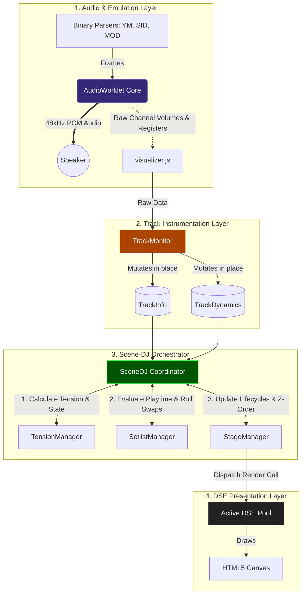

***

**`doc/Technical_spec.md`**
```markdown
# 💾 TECHNICAL SPECIFICATION: AUDIO-VISUAL PIPELINE & SCENE-DJ ARCHITECTURE
**Version:** 1.2.0 (Modular ECS-Pattern Revision)

This document outlines the architectural blueprint of the Chiptunes Fantasy real-time audio-visual pipeline. To maintain strict separation of concerns and guarantee 60FPS performance on low-end devices, the system decouples audio emulation, DSP analysis, scene orchestration, and rendering into distinct, zero-allocation modules.

---

## 1. The Audio-Visual Pipeline (Mermaid Diagram)

The following diagram illustrates the unidirectional data flow from the hardware emulator cores up to the final Canvas pixels.



---

## 2. Track Instrumentation (`TrackMonitor`)

The `TrackMonitor` serves as the bridge between the raw audio output and the visual orchestrator. Its sole responsibility is to translate raw `channelVolumes` and app state into two highly structured, **zero-allocation data classes**.

### Class 1: `TrackInfo` (Static Context)
Contains metadata about the currently playing song. This object only updates when the user switches tracks or systems, triggering structural resets.
*   `system` (String): e.g., `'c64'`, `'amiga'`, `'atari'`.
*   `coreId` (String): The active emulator core (e.g., `'sid-exact'`).
*   `sessionId` (Number): A monotonically increasing ID used for Unidirectional State Syncing.
*   `isPlaying` (Boolean): Global playback state.

### Class 2: `TrackDynamics` (Real-Time Metrics)
Updated every frame (60Hz). Contains the heavily filtered and calculated DSP metrics utilized by the DSEs. All properties are modified in place to prevent garbage collection (GC) spikes.
*   `masterEnergy` (Float): The RMS moving average of all active channels.
*   `transientPulse` (Float): A true rising-edge delta measuring instantaneous drum hits.
*   `beatEnvelope` (Float): A `0.0 -> 1.0` exponential decay curve (Groove Envelope) used for micro-dynamics (scale bounces, strobing).
*   `rawEnergyState` (String): The instantaneous threshold evaluation (`'playing'`, `'buildup'`, `'climax'`).

---

## 3. The Scene-DJ (Coordinator & Skills)

The `SceneDJ` acts as a **Facade Pattern**. It no longer executes complex math or array sorting itself. Instead, it holds instances of distinct "Skills" (Sub-Modules) and pipes the `TrackInfo` and `TrackDynamics` through them in a strict, sequential order.

### Skill 1: `TensionManager` (Macro-Dynamics)
Reads the crowd and builds suspense.
*   **Input:** `TrackDynamics`, `TrackInfo`
*   **Logic:** Integrates `masterEnergy` and `transientPulse` into a `tension` accumulator. It applies system-specific accumulation multipliers (e.g., Atari fills slower than Amiga).
*   **Output:** Determines the global `macroState` (`idle`, `playing`, `buildup`, `climax`), controls the Climax-Lock mechanism, and manages the `climaxHoldTime`.

### Skill 2: `SetlistManager` (Crate Digger / Swapping)
Responsible for variety and aesthetic coherence.
*   **Input:** The `macroState`, global `dseRegistry`, and `TrackInfo`.
*   **Logic:** Monitors the `minPlayTime` of all active elements. If an element expires during a calm `'playing'` or `'buildup'` phase, it performs a **Weighted Roulette-Wheel Selection**. 
*   **Protections:** Enforces *Black-Screen Protection* (ensuring at least one non-void DSE is active) and applies *Dynamic Weight Penalties* (halving the probability of a DSE if it is drawn consecutively).
*   **Output:** Tags old DSEs with `_markedForRemoval` and stages new DSEs.

### Skill 3: `StageManager` (Lifecycle & Crossfades)
The stage technician managing the active visual pool.
*   **Input:** `macroState`, flagged DSEs from the `SetlistManager`.
*   **Logic:** Handles the smooth transition of individual DSE states: `starting` $\to$ `[macroState]` $\to$ `stopping` $\to$ `idle`. It ensures outgoing effects gracefully fade out while incoming effects fade in. It manages the strict Z-Order sorting (`background` $\to$ `floor` $\to$ `foreground` $\to$ `overlay`).
*   **Output:** Executes the final `render()` command on all active DSE instances, passing down the finalized `TrackDynamics`.

---

## 4. Architectural Benefits of this Refactoring

1.  **Testability:** By extracting the DSP math into `TrackMonitor` and the selection logic into `SetlistManager`, each module can be unit-tested independently without requiring a full HTML5 Canvas context.
2.  **Scalability:** Adding a new feature (e.g., a `ColorThemeManager` that synchronizes color palettes across all active DSEs based on the track mood) only requires creating a new Skill module and attaching it to the `SceneDJ` facade.
3.  **Performance:** The entire pipeline guarantees **0% Garbage Collection overhead** during the active render loop. Arrays are sorted via pointer-swapping, and data objects mutate in place.
```

***

